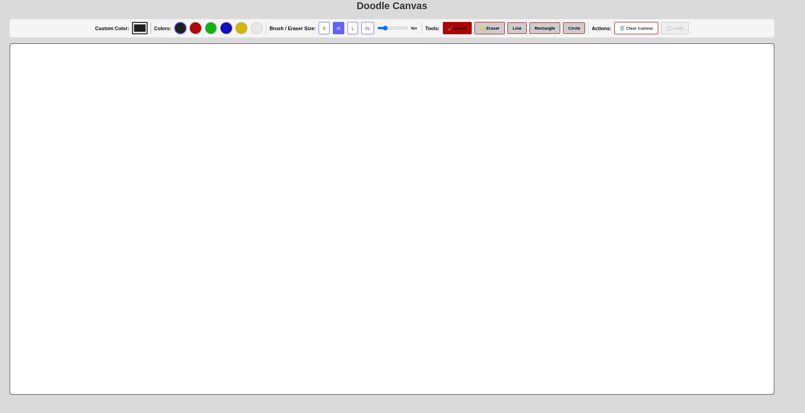
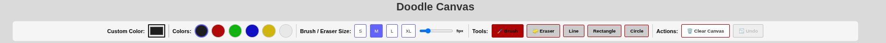

 Doodle Platform 🎨

A creative digital drawing platform built during **Global Hack Week** organized by **Major League Hacking (MLH)**. This interactive web application provides users with a comprehensive set of drawing tools to create digital artwork directly in their browser.

## 🌟 About the Event

This project was developed as part of **Global Hack Week**, a week-long virtual hackathon event conducted by **Major League Hacking (MLH)**. The event brings together developers, designers, and creators from around the world to build innovative projects and learn new technologies.

## 📸 Screenshots

### Main Drawing Interface


### Drawing Tools Panel



## ✨ Features

- **Interactive Drawing Canvas**: HTML5 Canvas-based drawing surface for smooth drawing experience
- **Multiple Drawing Tools**: 
  - Brush tool with adjustable sizes
  - Pencil for precise drawing
  - Eraser for corrections
  - Shape tools (rectangles, circles, lines)
- **Color Palette**: Comprehensive color selection with custom color picker
- **Brush Size Control**: Adjustable brush thickness for different drawing styles
- **Clear Canvas**: One-click canvas clearing functionality
- **Responsive Design**: Works seamlessly across desktop and mobile devices
- **Real-time Drawing**: Instant visual feedback while drawing

## 🚀 Technologies Used

- **Frontend Framework**: React 18 with TypeScript
- **Styling**: Tailwind CSS for modern, responsive design
- **UI Components**: Shadcn/UI component library
- **Build Tool**: Vite for fast development and optimized builds
- **Canvas API**: HTML5 Canvas for drawing functionality
- **State Management**: React hooks for component state
- **Routing**: React Router for navigation

## 🎯 How to Use

1. **Select a Drawing Tool**: Choose from brush, pencil, eraser, or shape tools
2. **Pick a Color**: Use the color palette or custom color picker to select your desired color
3. **Adjust Brush Size**: Use the size slider to control the thickness of your strokes
4. **Start Drawing**: Click and drag on the canvas to create your artwork
5. **Use Shapes**: Select shape tools to draw geometric shapes
6. **Erase Mistakes**: Switch to eraser tool to correct any errors
7. **Clear Canvas**: Use the clear button to start fresh

## 🏗️ Project Structure

```
Doodle_Platform/
├── src/
│   ├── components/          # React components
│   │   ├── ui/             # Shadcn UI components
│   │   ├── DrawingCanvas/  # Main canvas component
│   │   ├── ToolPanel/      # Drawing tools panel
│   │   └── ColorPicker/    # Color selection component
│   ├── hooks/              # Custom React hooks
│   ├── lib/                # Utility functions
│   ├── pages/              # Page components
│   └── styles/             # CSS and styling files
├── public/                 # Static assets
└── docs/                   # Documentation files
```


## 📋 Future Enhancements

- [ ] Save/Load drawings functionality
- [ ] Multiple layers support
- [ ] Advanced brush textures
- [ ] Image import and manipulation
- [ ] Collaborative drawing features
- [ ] Drawing templates and stencils
- [ ] Export drawings in various formats (PNG, SVG, PDF)
- [ ] User accounts and gallery
- [ ] Mobile app version

## 🎊 Global Hack Week Experience

This project represents my journey during Global Hack Week, where I:
- Learned new web technologies and best practices
- Built a complete full-stack application from scratch
- Implemented creative features for digital art creation
- Gained experience with modern React development
- Connected with the global developer community

Special thanks to **Major League Hacking** for organizing this amazing event and providing the platform to learn, build, and connect with fellow developers worldwide.

**Made with ❤️ during Global Hack Week by Major League Hacking**

⭐ Star this repository if you found it helpful!